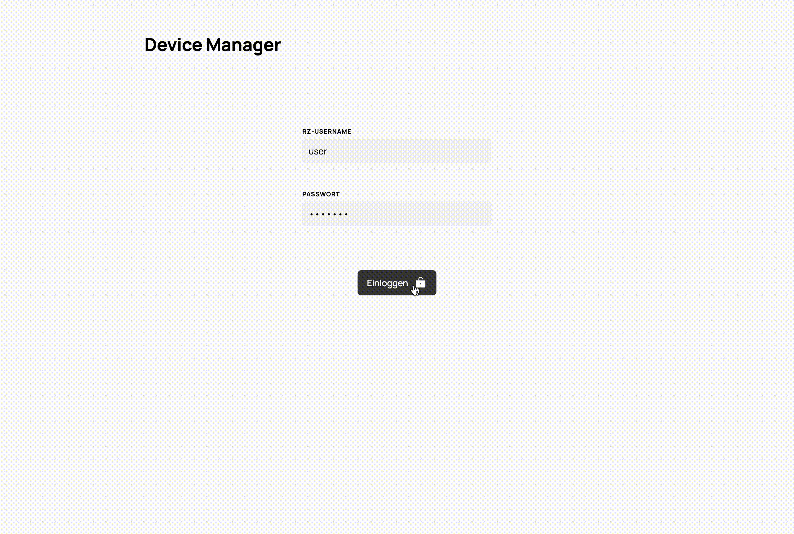
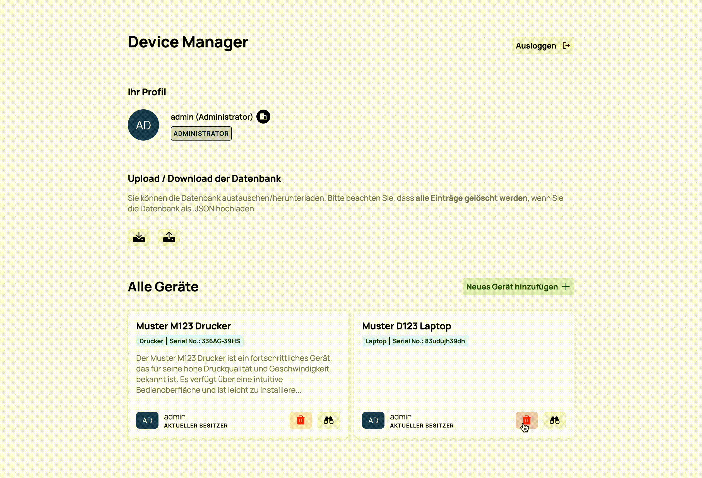
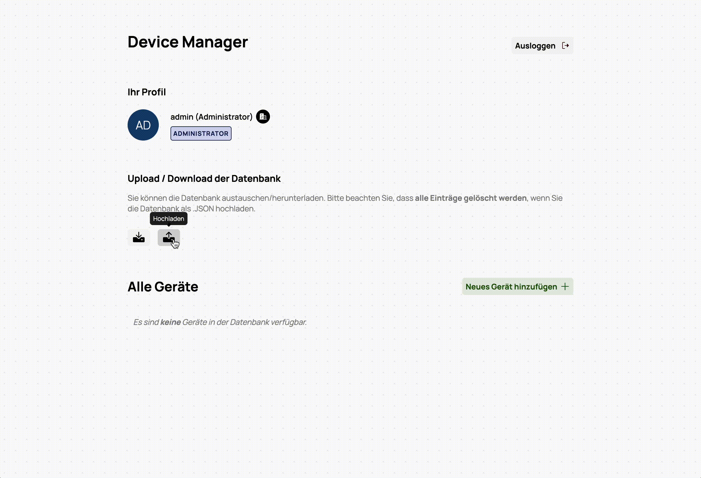
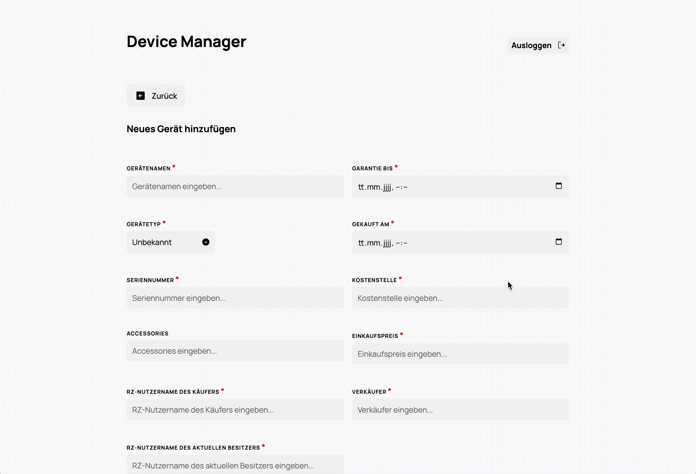
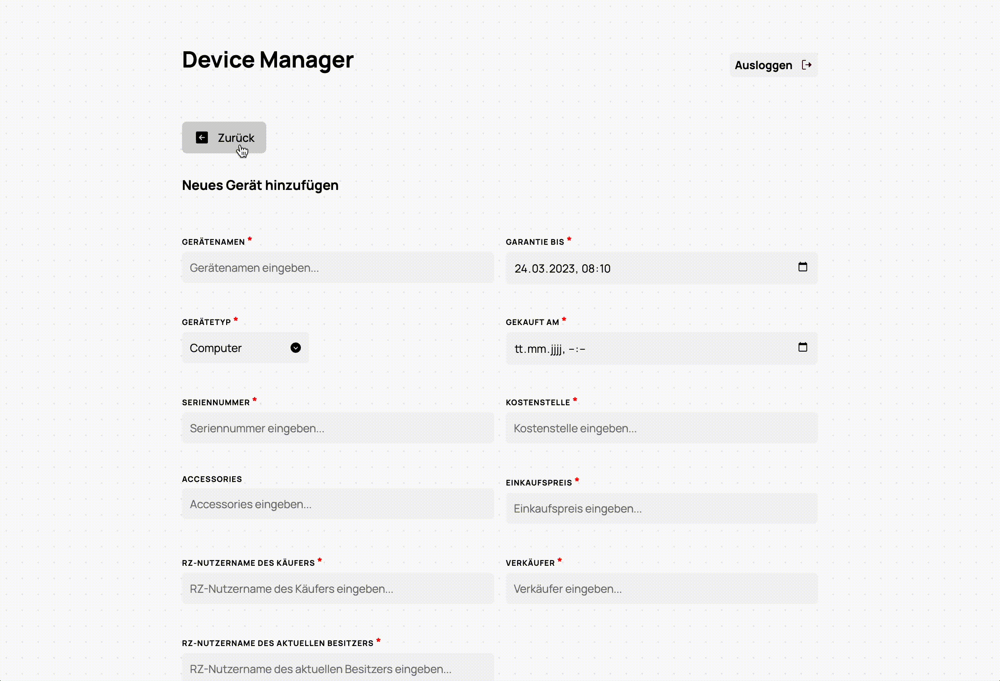
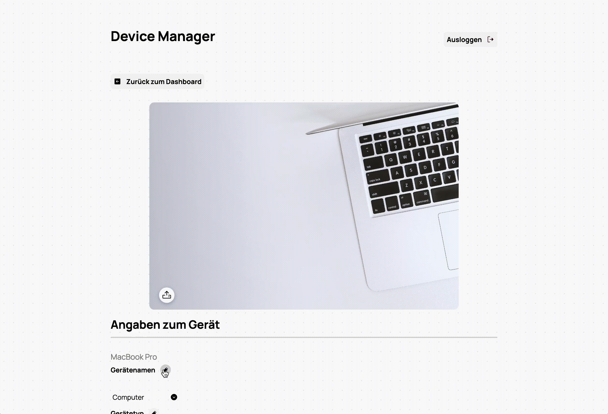
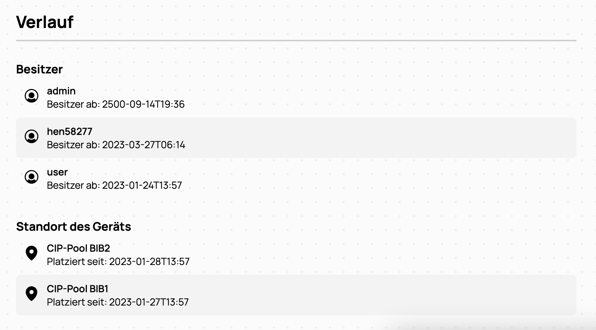
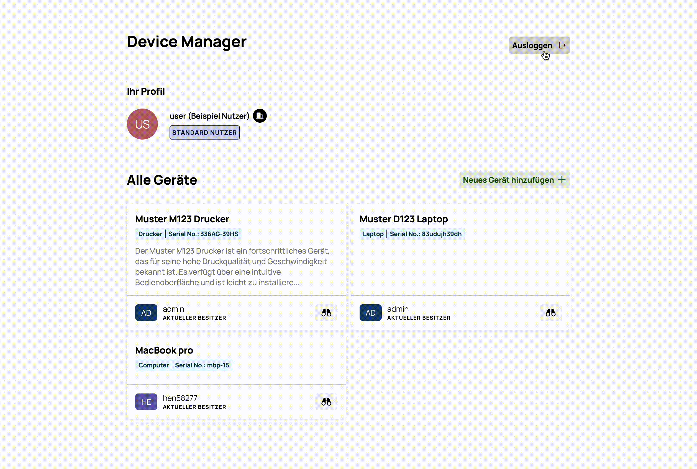
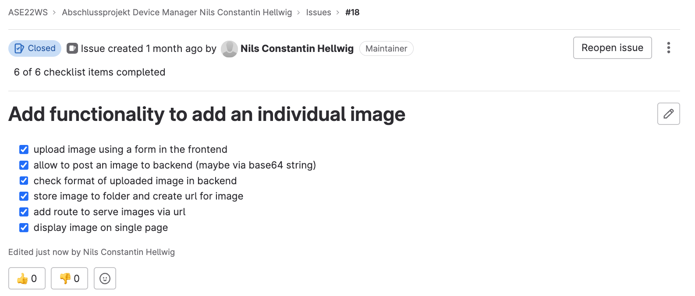

<p align="center">
  
</p>

# Device Manager

This device manager was developed as part of the course _Advanced Software Engineering_ (module code: 36632b) at the University of Regensburg.

The Device Manager is a web-based solution for managing devices at the University of Regensburg. For this purpose, a backend with [FastAPI](https://fastapi.tiangolo.com/) ⚡ and a [SQLite](https://sqlite.org/index.html) database as well as a frontend with [React.js](https://reactjs.org/) ⚛️ were implemented.

## Contributors

| &nbsp;                                                                            | Name                    | Contact                               |
| --------------------------------------------------------------------------------- | ----------------------- | ------------------------------------- |
|  | Nils Constantin Hellwig | Nils-Constantin.Hellwig@student.ur.de |

## Installation

For both of the following installation guides (Docker / Manual Installation), clone this repository:

```sh
   git clone https://git.uni-regensburg.de/ase22ws/abschlussprojekt-device-manager-nils-constantin-hellwig.git
```

By default, there are two users with whom you can log in:

| Username | Password   |
| -------- | ---------- |
| `admin`  | vollgeheim |
| `user`   | test123    |

### Docker (recommended)

In the main directory there is a `docker-compose.yml`. The containers described in it can be started as follows:

```sh
docker-compose up
```

The backend (API) is accessible via http://localhost:8000 (documentation via http://localhost:8000/api/docs). The frontend can be opened in the browser via this link: http://localhost:3000.

**Additional Note:** For Production proposes, a database file, logging file and the folder with the device's images can be mounted using the `volumes` key in docker-compose.yml:

```yml
...
backend_device_manager:
  ...
  volumes:
    - ./backend/public_images:/public_images
    - ./backend/logger.csv:/logger.csv
    - ./backend/device_manager_app.db:/device_manager_app.db
```

These files can then be stored on the host file system instead of being stored inside of the container.

### Manual Installation

Requirements:

- [Node.js](https://nodejs.org/en/)
- Python 3 environment (e.g. using a [Virtual Environment](https://docs.python.org/3/library/venv.html) or [Conda](https://anaconda.org/)) to install required packages

#### Backend

1. Navigate to `/backend`:

```sh
cd backend
```

2. Install required packages:

```sh
pip install -r requirements.txt
```

3. Start API (Frontend listens to `locahost:8000`):

```sh
uvicorn --host 0.0.0.0 --port 8000 device_manager_app.main:app --reload
```

#### Frontend

1. Add a second command line session and navigate to `/frontend`:

```sh
cd frontend
```

2. Install required packages:

```sh
npm install
```

3. Start development server (Development server should be accessable at http://localhost:3000):

```sh
npm start
```

(Optional) For production run:

```sh
npm run build
```

## Testing

In order to test a wide range of the backend's functionalities, a testsuite has been implemented which can be found in the `/tests` folder. It tests post, get, update API requests as well as the routes for authentication. To execute the tests, [pytest](http://docs.pytest.org) must be used.

To perform the tests the following steps must be followed:

1. Navigate to the directory with all tests

```sh
cd tests
```

2. Install all required packages

```sh
pip install -r requirements.txt
```

3. Execute all Tests (Detailled Report)

```sh
pytest . --no-header -vv
```

**Important note:** Running this script will delete all entries from the database used by the backend.

## Environment Variables

There are some environment variables that can be specified optionally. Default values are specified in the project. However, it is highly recommended to use other passwords and hashing codes for production.

| Variable                      | Default Value                                                    |
| ----------------------------- | ---------------------------------------------------------------- |
| `FRONTEND_URL`                | http://localhost:3000                                            |
| `REACT_APP_BACKEND_URL`       | http://0.0.0.0:8000                                              |
| `SECRET_KEY_HASHING`          | be23577f58d27f38c6ef90693dadcb00148c37810af6849ce11bcfcbc450803e |
| `ALGORITHM_HASHING`           | HS256                                                            |
| `ADMIN_PASSWORD`              | vollgeheim                                                       |
| `TEST_STANDARD_USER_PASSWORD` | test123                                                          |
| `ACCESS_TOKEN_EXPIRE_MINUTES` | 120                                                              |
| `PUBLIC_IMAGES_DIR`           | ./public_images                                                  |

Example for adding a environmental variable:

```sh
export REACT_APP_BACKEND_URL=http://0.0.0.0:8000
```

## Logging

Every request to the backend is logged. A middleware (at the end of `backend/device_manager_app/main.py`) was implmented in FastAPI for this purpose. Logs stored in `backend/logger.csv`.

Example:

```
timestamp request,request route,request method,response code,duration in ms
Wed Apr  5 09:43:42 2023,/api/check_auth,GET,401,0.7119178771972656
```

Optionally, the body request / response of the routes could also be saved. For this, the marked positions from the middleware must be commented out.

## Requirements

### Backend

- FastAPI is used for developing a _RESTful_ API
- Detailled Documentation regarding all available routes should be acessible via `/api/docs`
- Via `/api/login`, one is able to authenticate via POST request with user/password
- All actions that change data are only possible if authenticated, wherby devices/users can only be deleted with the authenticated user having admin privileges
- If the backend is started, the two user accounts admin (with admin privileges) and user123 are created (if they do not exist)
- An endpoint `/api/export`, which outputs the complete database content as JSON data.
- An endpoint `/api/import`, which transfers all transferred JSON data into the database into the database, data gets validated in backend (only if valid, entires are persisted in the database). This route should be able to accept the dummy data that is available [here](https://git.uni-regensburg.de/ase22ws/datenmodell/-/blob/main/import_dummy.json).
- With the help of `/api/purge` it should be possible to delete all available entries in the database
- All actions are to be stored in a log file, a middleware was implemented for this purpose (execution times and status code are stored, among other things).

#### Database Architecture

##### Users

| Column               | Type    | Unique | Required |
| -------------------- | ------- | ------ | -------- |
| rz_username `PK`     | String  | Yes    | Yes      |
| full_name            | String  | No     | Yes      |
| organisation_unit    | String  | No     | Yes      |
| has_admin_privileges | Boolean | No     | Yes      |
| hashed_password      | String  | No     | Yes      |

##### Devices

| Column            | Type   | Unique | Required |
| ----------------- | ------ | ------ | -------- |
| device_id `PK`    | String | Yes    | Yes      |
| title             | String | No     | Yes      |
| device_type       | String | No     | Yes      |
| description       | String | No     | No       |
| accessories       | String | No     | No       |
| rz_username_buyer | String | Yes    | Yes      |
| serial_number     | String | No     | Yes      |
| image_url         | String | No     | Yes      |

#### OwnerTransactions

| Column                    | Type                                                         | Unique | Required |
| ------------------------- | ------------------------------------------------------------ | ------ | -------- |
| owner_transaction_id `PK` | String                                                       | Yes    | Yes      |
| rz_username               | String                                                       | No     | Yes      |
| timestamp_owner_since     | Integer [_(Unix Timestamp)_](https://www.unixtimestamp.com/) | No     | Yes      |
| device_id `FK`            | String                                                       | No     | Yes      |

#### LocationTransactions

| Column                       | Type                                                         | Unique | Required |
| ---------------------------- | ------------------------------------------------------------ | ------ | -------- |
| location_transaction_id `PK` | String                                                       | Yes    | Yes      |
| room_code                    | String                                                       | No     | Yes      |
| timestamp_located_since      | Integer [_(Unix Timestamp)_](https://www.unixtimestamp.com/) | No     | Yes      |
| device_id `FK`               | String                                                       | No     | Yes      |

#### PurchasingInformation

| Column                         | Type                                                         | Unique | Required |
| ------------------------------ | ------------------------------------------------------------ | ------ | -------- |
| purchasing_information_id `PK` | String                                                       | Yes    | Yes      |
| price                          | String                                                       | No     | Yes      |
| timestamp_warranty_end         | Integer [_(Unix Timestamp)_](https://www.unixtimestamp.com/) | No     | Yes      |
| timestamp_purchase             | Integer [_(Unix Timestamp)_](https://www.unixtimestamp.com/) | No     | Yes      |
| cost_centre                    | Integer (len=8)                                              | No     | Yes      |
| seller                         | String                                                       | No     | No       |
| device_id `FK`                 | String                                                       | Yes    | Yes      |

### Frontend

In order to retrieve data regarding the devices in a user-friendly way, a simple frontend was developed that makes requests to the API and displays information fetched from the backend. The requirements for this interface are described below in the form of user stories. In addition, quality of service and design requirements are described.

#### User Stories: General functionality for all users

- As a user, I would like to be able to log in with my account so that I can access the main user interface / device data.

- As a user, I would like to be able to add a new device using a form so that they are saved in the database.

- As a user, I would like to be advised if information regarding a new unit is incorrect/incomplete when using the form (to add a new device) so that I can adjust/add missing information to it.

- As a user, I would like to close a form if I decide not to add a new device after all, so that I'm back on the page with all devices being listed.

- As a user, I would like to have access to a list of all the devices in the database so that I can find information about them.

- As a user, I would like to be able to select a device in the list to view more detailed information on it.

- As a user, I would like to be able to edit information on the detailed information page for a device regarding the current owner and location of the device.

- As a user, I would like to be able to see all the information available on a device on the detailed information page.

- As a user I do not want to have to log in again when I reload the page or go to the page at a later time so that I have direct access to all functionalities.

#### User Stories: Explicitly for administrators

- As an administrator, I want to be able to view a list of who previously owned a device on the detail page of a device.

- As an administrator, I would like to be able to edit information on the detailed information page for a device in order to adjust it in the database.

#### Service quality and design

- The design should be simple but aesthetically pleasing
- Users should stay logged in after they refresh the page or come back to the page later. This is to be made possible by a cookie.
- The user interface should be responsive so that it can be used comfortably on both a PC and a mobile device.
- When selecting a device/room code, help users to select a valid value
- The possibility to register in the front-end is not intended. However, there `/api/register` allows users with admin privileges to create new user accounts.

## Usage Explained (Step by Step)

After the backend and frontend have been started and the frontend listens to the ip/port of the backend, users can authenticate in the frontend. The [LocalStorage API](https://developer.mozilla.org/en-US/docs/Web/API/Window/localStorage) was used to ensure that users remain logged in even during a page refresh and are only redirected to the login screen once the token has expired.

<br>
<p align="center">
  
</p>
<br>

As soon as you have logged in, the main page appears with information about the logged-in user (name, privileges, organisation unit) and a list of all devices in the database. Administrators are allowed to delete devices from the database using the delete button.

<br>
<p align="center">
  
</p>
<br>

In addition, administrators are allowed to download the database as a JSON file or import entries as a JSON file using the frontend.

<br>
<p align="center">
  
</p>
<br>

Logged-in users can add devices by clicking on "Neues Gerät hinzufügen". When entering data, the system tries to help the user as much as possible by providing drop-down menus with choices for the individual data as well as suggestions.

<br>
<p align="center">
  
</p>
<br>

There is also the possibility to upload pictures, which are then stored in the database for a device.

<br>
<p align="center">
  
</p>
<br>

Finally, when submitting the data to add a new device, detailed error messages are displayed in case of invalid input for one of the fields. If you want to leave the form before submitting it, you will be informed that the fields you have entered until then are not to be stored after closing the form.

<br>
<p align="center">
  
</p>
<br>

For devices that have already been saved in the database, administrators can change all data in the frontend.

<br>
<p align="center">
  
</p>
<br>

Images can also be uploaded subsequently by administrators. Images that have been replaced are deleted in the backend and are not versioned.

<br>
<p align="center">
  
</p>
<br>

A user without admin privileges is only allowed to change the current owner / location of a device. This permission is ensured by both the backend and frontend.

<br>
<p align="center">
  
</p>
<br>

Administrators are allowed to view the versioning regarding location/owner at the end of the detail page.

<br>
<p align="center">
  
</p>
<br>

Once you have finished using the Device Manager service, you can log out at any time using the logout button.

<br>
<p align="center">
  
</p>
<br>

## Working with the repository

- **Issues**: Issues are used in GitLab for each feature of the software to be implemented. Particularly in the case of bigger features, acceptance criteria are formulated so that it can be checked in the course of development which part still has to be implemented. At the end it needs to be checked whether all acceptance criteria have been met before closing the issue.

<br>
<p align="center">
  
</p>
<br>

- **Branches**: For every issue that describes a feature to be implemented, a branch should be created based on the main branch.

- **Commits**: Commit messages should always be in the imperative present tense and should describe the changes briefly and accurately.

## Sources:

- FastAPI documentation: https://fastapi.tiangolo.com/
- Simple OAuth2 with Password and Bearer: https://fastapi.tiangolo.com/tutorial/security/simple-oauth2/
- FastAPI Tutorial: https://fastapi.tiangolo.com/tutorial/sql-databases/
- React concepts: https://www.w3schools.com/react/
- pytest documentation: https://docs.pytest.org/en/7.2.x/

Further sources are additionally mentioned in the source code.

## License

This project is licensed under the terms of the [MIT license](https://www.opensource.org/licenses/mit-license.php) (see here: [LICENSE](LICENSE)).

### Third-party licenses

All external packages must be installed using pip/npm and are **not** part of this source code / repository.

#### Backend

| Column           | License                                 | Link                                                                            |
| ---------------- | --------------------------------------- | ------------------------------------------------------------------------------- |
| FastAPI          | MIT License                             | [LICENSE](https://github.com/tiangolo/fastapi/blob/master/LICENSE)              |
| SQLAlchemy       | MIT License                             | [LICENSE](https://docs.sqlalchemy.org/en/14/copyright.html)                     |
| uvicorn          | BSD 3-Clause "New" or "Revised" License | [LICENSE](https://github.com/encode/uvicorn/blob/master/LICENSE.md)             |
| bcrypt           | Apache License 2.0                      | [LICENSE](https://github.com/pyca/bcrypt/blob/main/LICENSE)                     |
| python-jose      | MIT License                             | [LICENSE](https://github.com/mpdavis/python-jose/blob/master/LICENSE)           |
| passlib          | BSD 2-Clause License                    | [LICENSE](https://github.com/glic3rinu/passlib/blob/master/LICENSE)             |
| python-multipart | Apache License 2.0                      | [LICENSE](https://github.com/andrew-d/python-multipart/blob/master/LICENSE.txt) |
| pytest           | MIT License                             | [LICENSE](https://github.com/pytest-dev/pytest/blob/main/LICENSE)               |
| requests         | Apache License 2.0                      | [LICENSE](https://github.com/psf/requests/blob/main/LICENSE)                    |

#### Frontend

| Column                  | License     | Link                                                                           |
| ----------------------- | ----------- | ------------------------------------------------------------------------------ |
| React.js                | MIT License | [LICENSE](https://github.com/facebook/react/blob/main/LICENSE)                 |
| Phosphor Icons          | MIT License | [LICENSE](https://github.com/phosphor-icons/web/blob/master/LICENSE)           |
| @radix-ui/react-tooltip | MIT License | [LICENSE](https://github.com/radix-ui/primitives/blob/main/LICENSE)            |
| @react-md/autocomplete  | MIT License | [LICENSE](https://github.com/mlaursen/react-md/blob/main/LICENSE)              |
| React Toastify          | MIT License | [LICENSE](https://github.com/fkhadra/react-toastify/blob/main/LICENSE)         |
| react-confirm-alert     | MIT License | [LICENSE](https://github.com/GA-MO/react-confirm-alert/blob/master/LICENSE.md) |
